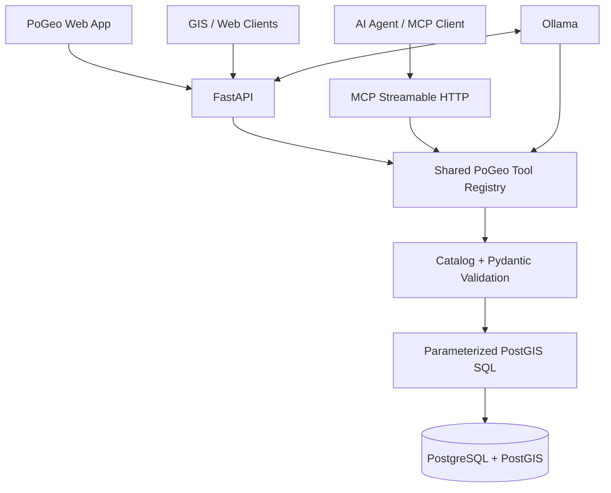

<div align="center">
  

  **AI-native, MCP-ready geospatial APIs for PostGIS**

  [](https://github.com/vtavakkoli/AutoUpdate/actions/workflows/ci.yml)
  [](https://www.python.org/)
  [](https://fastapi.tiangolo.com/)
  [](LICENSE)
</div>

PoGeo turns an allowlisted PostGIS catalog into secure GeoJSON APIs, vector tiles, MCP tools,
and a local-AI map assistant. It is designed as a focused modern geospatial server rather than a
line-by-line replacement for GeoServer.

The demonstration includes Vienna points of interest, a responsive Leaflet map, and an Ollama chat
interface. The model can inspect collections and execute validated spatial tools, but it cannot run
arbitrary SQL or access database credentials.

## Highlights

- **FastAPI application** with OpenAPI, health/readiness checks, CORS, security headers, and metrics.
- **PostGIS-native querying** for bounding boxes, property filters, nearest neighbours, GeoJSON, and MVT.
- **MCP Streamable HTTP** tools and resources mounted at `/mcp`.
- **Ollama tool calling** through the same validated geospatial functions used by MCP and REST.
- **Catalog allowlist** for PostgreSQL schemas, tables, identifiers, properties, limits, and geometry.
- **Professional Docker Compose example** with PostGIS, optional Ollama, model provisioning, and tests.
- **Map-and-chat web application** served by PoGeo without a separate frontend build system.
- **Automated quality checks** with Ruff, pytest, coverage, HTML reports, and GitHub Actions.

## Architecture



REST, MCP, and Ollama do not maintain separate query implementations. They converge on the same
catalog, request models, geospatial service, and parameterized SQL builder.

## Quick start

### API, web application, and PostGIS

```bash
docker compose up --build -d postgis pogeo
```

Open:

- Web application: <http://localhost:8000>
- OpenAPI/Swagger: <http://localhost:8000/docs>
- Collections: <http://localhost:8000/collections>
- Metrics: <http://localhost:8000/metrics>
- MCP endpoint: `http://localhost:8000/mcp`

### Include local AI with Ollama

```bash
docker compose --profile ai up --build -d
```

The `ollama-pull` service downloads `${OLLAMA_MODEL:-qwen3:4b}` once and stores it in the
`ollama-data` volume. Model downloads can take time depending on the selected model and network.
Check progress with:

```bash
docker compose logs -f ollama ollama-pull
```

Select another tool-capable model:

```bash
OLLAMA_MODEL=qwen3:8b docker compose --profile ai up --build -d
```

### Stop or reset

```bash
docker compose --profile ai down
# Delete databases and downloaded models as well:
docker compose --profile ai down -v
```

## Try the geospatial API

List published collections:

```bash
curl http://localhost:8000/collections
```

Return museums in Vienna's first district:

```bash
curl "http://localhost:8000/collections/places/items?category=museum&district=1&limit=20"
```

Find the three nearest places to St. Stephen's Cathedral:

```bash
curl "http://localhost:8000/api/nearest?collection_id=places&longitude=16.3731&latitude=48.2085&limit=3"
```

Request a Mapbox Vector Tile:

```bash
curl --output places.pbf \
  http://localhost:8000/collections/places/tiles/12/2234/1422.pbf
```

Ask Ollama to use PoGeo tools:

```bash
curl http://localhost:8000/api/chat \
  -H "Content-Type: application/json" \
  -d '{
    "message": "Show all museums in district 1 and summarize them",
    "map_context": {
      "bbox": [16.30, 48.17, 16.44, 48.27],
      "zoom": 12,
      "visible_collections": ["places"]
    }
  }'
```

## MCP

PoGeo uses the official Python MCP SDK and exposes a stateless Streamable HTTP server at:

```text
http://localhost:8000/mcp
```

Available tools:

| Tool | Purpose |
|---|---|
| `list_collections` | Discover approved geospatial collections. |
| `describe_collection` | Read geometry, CRS, and allowed properties. |
| `query_features` | Query GeoJSON by bounding box and exact-match filters. |
| `find_nearest` | Perform PostGIS nearest-neighbour and radius searches. |

Resources:

```text
pogeo://catalog
pogeo://collections/{collection_id}
```

Run the included client example after starting PoGeo:

```bash
python -m pip install -e .
python examples/mcp_client.py
```

The MCP interface intentionally does **not** expose `execute_sql`.

## Catalog configuration

PoGeo publishes only entries declared in `config/collections.yaml`:

```yaml
collections:
  - id: places
    title: Vienna Places
    schema: pogeo
    table: places
    id_column: id
    geometry_column: geom
    geometry_type: Point
    srid: 4326
    properties:
      - name
      - category
      - district
      - description
    default_limit: 100
    max_limit: 1000
```

Schema, table, geometry, ID, and property names are validated as PostgreSQL identifiers. Filters
are accepted only for properties in this file. User and model values are always sent as query
parameters.

## Configuration

All settings use the `POGEO_` environment prefix.

| Variable | Default | Description |
|---|---|---|
| `POGEO_DATABASE_URL` | local PostgreSQL URL | Async PostgreSQL connection string. |
| `POGEO_CATALOG_PATH` | `config/collections.yaml` | Published collection catalog. |
| `POGEO_WEB_PATH` | `web` | Static demonstration application. |
| `POGEO_OLLAMA_BASE_URL` | `http://localhost:11434` | Ollama server URL. |
| `POGEO_OLLAMA_MODEL` | `qwen3:4b` | Tool-capable model used for chat. |
| `POGEO_OLLAMA_TIMEOUT_SECONDS` | `180` | AI request timeout. |
| `POGEO_MAX_FEATURES` | `1000` | Global maximum features per query. |
| `POGEO_MAX_TOOL_ITERATIONS` | `5` | Maximum tool calls in one chat request. |
| `POGEO_CORS_ORIGINS` | `http://localhost:8000` | Comma-separated allowed origins. |

Copy `.env.example` to `.env` for local customization.

## API surface

```text
GET  /health
GET  /ready
GET  /metrics
GET  /api/ai/status
POST /api/chat

GET  /api/ogc
GET  /conformance
GET  /collections
GET  /collections/{collectionId}
GET  /collections/{collectionId}/items
GET  /collections/{collectionId}/items/{featureId}
GET  /collections/{collectionId}/tiles/{z}/{x}/{y}.pbf
GET  /api/nearest

POST /mcp
```

The current OGC routes follow OGC API conventions, but PoGeo 0.1 does not yet claim complete
conformance certification.

## Development

Python 3.12 or newer is required.

```bash
python -m venv .venv
source .venv/bin/activate
python -m pip install -e ".[dev]"
make lint
make unit
```

Start the local services:

```bash
make up
# or with Ollama
make up-ai
```

Run the complete Docker integration suite and create `reports/test-report.html`:

```bash
make test
```

## Security model

PoGeo's safe default is read-only:

- Collections and properties are explicitly allowlisted.
- PostgreSQL identifiers are validated and quoted.
- Values are parameterized and never interpolated into SQL.
- Arbitrary SQL is unavailable through REST, MCP, and Ollama.
- Feature and AI iteration limits are enforced by the server.
- PostgreSQL statements have a timeout.
- The application container is non-root, read-only, and uses `no-new-privileges`.
- Ollama receives schemas and result payloads, not credentials.

The Compose stack is a development example. Production deployments should add TLS, OIDC/OAuth,
network policies, secret management, PostgreSQL row-level security, persistent audit logging,
rate limiting, and a restrictive database role.

See [SECURITY.md](SECURITY.md) and [docs/architecture.md](docs/architecture.md).

## Roadmap

- CQL2 text and JSON filters.
- OGC API Tiles metadata and formal conformance tests.
- PostgreSQL row-level-security context propagation.
- OIDC/OAuth protection for REST and MCP.
- Redis-backed tile and result caching.
- Additional spatial tools such as intersects, within-distance joins, and aggregation.
- Configurable styles and MapLibre vector-tile demonstration.
- Audited write workflows with explicit human approval.

## License

Copyright 2026 Vahid Tavakkoli.

Licensed under the [Apache License 2.0](LICENSE).
